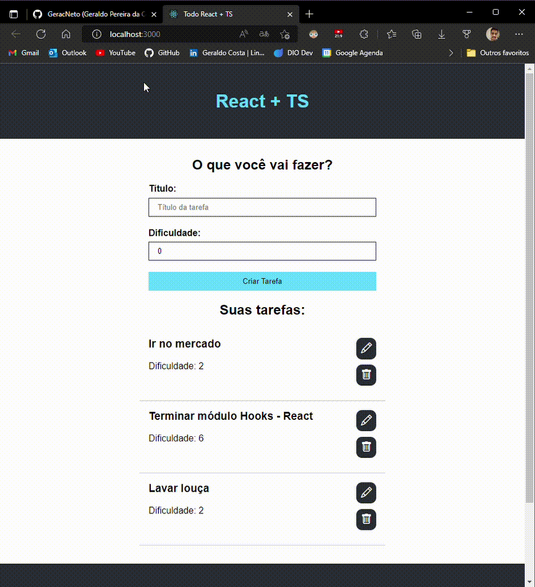
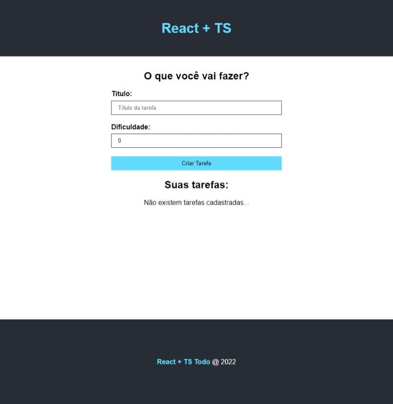
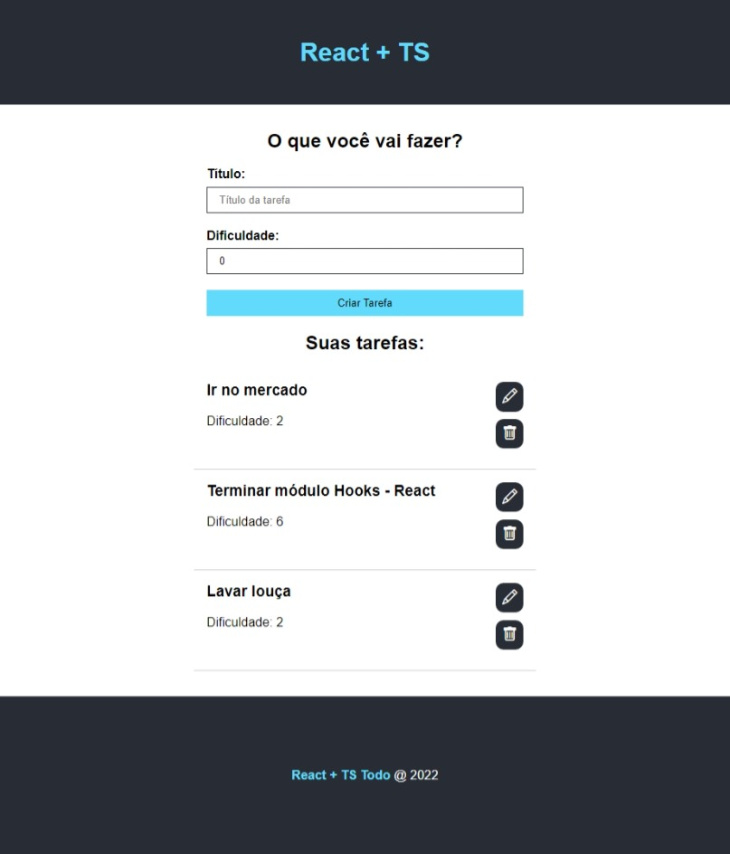
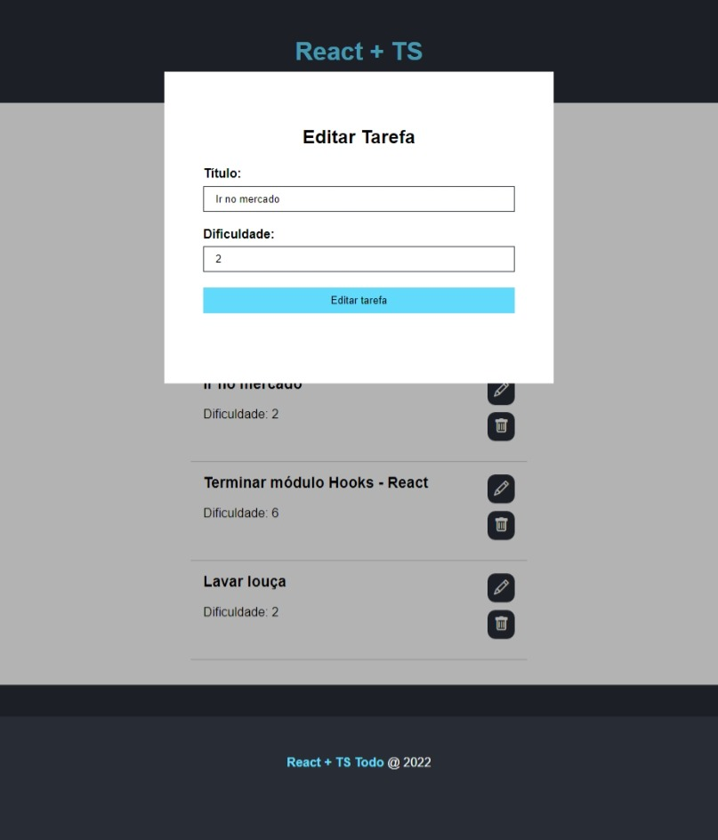

# Projeto To do - React + Typescript

## Aplicação de gerenciamento de tarefas (to do list) desenvolvida em React, Typescript e ícones do Bootstrap

<div align="center" style="display: inline_block"><br>
  
  
  
  
  
</div>
<br>

## Home





## To Do List



## Modal Edit Task



<hr>

# Install

Clone this repository and install it dependencies with this command:
```sh
$ npm install
```
Run the application with npm start command, it will start the app:
```sh
$ npm start
```
